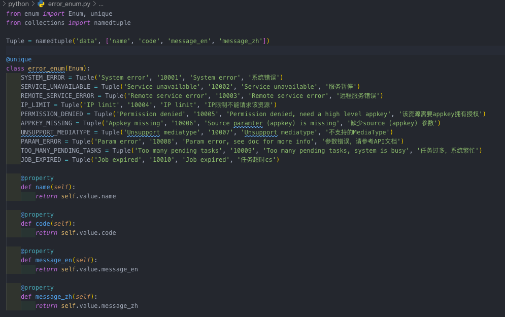

English | [简体中文](./README-zh_CN.md)

## 💎 Project Introduction

The project address: [GitHub](https://github.com/HurTeng/ErrorCode)

What do you generally do when you start learning a new language? Write a ***Hello World*** and print it out?
I believe everyone is familiar with this scene, but just printing a simple ***Hello World*** will allow you to quickly learn a new language? The answer is no.

Programming languages are similar, except that the syntax is different, but the focus of programming is on the logical implementation of the code and the algorithm.
Therefore, learning a new language needs to be combined with actual coding. By implementing a program function, you can familiarize yourself with the syntax of the programming language and enable you to quickly master the language.

In this project, I used Java, Kotlin, JavaScript, Python, Dart, Go to implement a small program that generates csv text corresponding to the language code.

## ✨ Function Description

This is a small program that reads text and generates code.Its function is as follows:

- Read the text of a csv
- Parse the data line by line
- Extract and split the content of each line to generate metadata
- Generate these data into the constant class and enumeration code of the corresponding language.

Contents of csv text:


Generated file:


Generated code:

- Java


- JavaScript


- Kotlin


- Python



- Dart


- Go


## 🔑 Realization Principle


The table contains two-dimensional data, and the data is organized by rows and columns.

- The first row is the header row, and the cells in it represent related attributes
- The first column is the index column, where the cells represent the relevant names
- Each row of the table represents a set of data (can be understood as an object, each cell represents the relevant attributes of the object)

After parsing the data according to the above rules, we can generate corresponding constant classes and enumeration classes through character templates.

## 📖 Knowledge Comb

The knowledge involved in this is:

- Reading and writing files
- Asynchronous programming
- Exception Handling
- String processing
- Regular expression
- Logical control flow
- Class, variable, method function definitions
- Variable scope
- Basic data types
- Collections (arrays, lists, mappings)
- Traversal of collections
- Optional and default parameters
- Enumeration
- Structure

## ❤️ Special Note

Although the function of this program is simple, it covers a series of basic programming language knowledge points, through which you can quickly learn and master a new language.
No need to write simple ***Hello World***, try to complete this small program with code. When you implement this small program, you will find that mastering a language is not as difficult as you think.

This project is just an introduction, for your reference. If you find that the code is not written well, or if there are other new language implementations, you are welcome to contribute the code to PR.
I hope everyone can learn useful things from this project. If you like this project, you can order it ⭐️️ **Star** Favorites

## ⚖️ Project License

```html
Copyright 2020 HurTeng

Licensed under the Apache License, Version 2.0 (the "License");
you may not use this file except in compliance with the License.
You may obtain a copy of the License at

   http://www.apache.org/licenses/LICENSE-2.0

Unless required by applicable law or agreed to in writing, software
distributed under the License is distributed on an "AS IS" BASIS,
WITHOUT WARRANTIES OR CONDITIONS OF ANY KIND, either express or implied.
See the License for the specific language governing permissions and
limitations under the License.
```
